# Behavioral Cloning Project

## Introduction

What a time to be alive! The year is 2017, Donald Trump is president of the United States of America and autonomous vehicles are all the rage. Still at its infancy, the winning solution to dominate the mass production of autonomous vehicles are ongoing. The two main factions currently are the robotics approach and the end-to-end neural networks approach. Like the four seasons, the AI winter has come and gone. It's Spring and this is the story of one man's attempt to explore the pros and cons of the end-to-end neural networks faction in a controlled environment. The hope is to draw some conclusions that will help the greater community advance as a whole.

## The Controlled Environment

    
  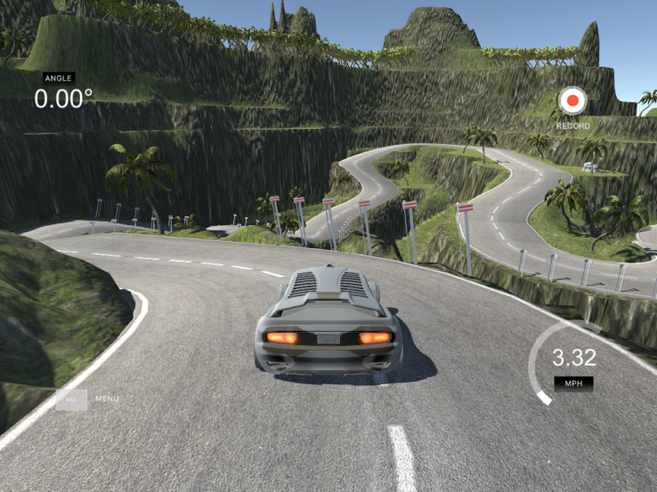  

The [Udacity Simulator](https://github.com/udacity/self-driving-car-sim) which is open sourced will be our controlled environment for this journey. It has two modes, training and autonomous mode. Training mode is for the human to drive and record/collect the driving. The result would be a directory of images from three cameras (left, center, right) and a driver log CSV file that records the image along with steering angle, speed etc. Autonomous mode requires a model that can send the simulator steering angle predictions.

    
  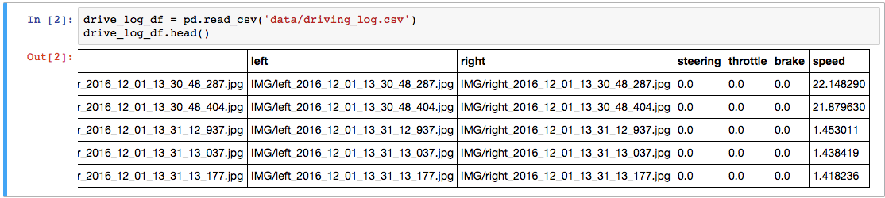  

The goals of this project are:

1. Use the simulator to collect data of good driving behavior.
2. Construct a convolution neural network in [Keras](https://keras.io/) that predicts steering angles from images.
3. Train and validate the model with a training and validation set.
4. Test that the model successfully drives around track one without leaving the road!
5. Draw conclusions for future work.

# Data Exploration

If you think the Lewis and Clark expedition was tough, try exploring an unknown dataset. I am being dramatic. When you are exploring data; you want to keep thinking, what is the least amount of data you can sample which will represent your problem (population if you like stats). For this problem we will be using the provided Udacity dataset. Let's dive in!

Our goal is steering angle prediction, so let's take a look at what the dataset shows us! The plot below shows a few take aways:

1. Range is [-1,1]
2. Clustering around [-0.5, 0.5]

    
  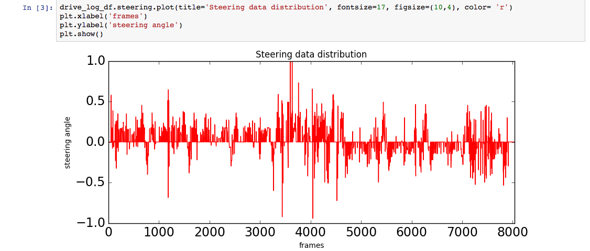  

Let's take a look at another angle, pun intended, of the steering data.

    
  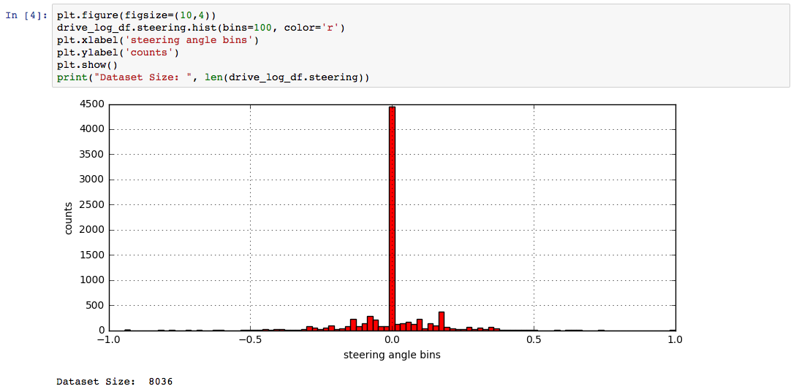  

This histogram is the making of sampling nightmares; this is how alternate facts are created! Unbalanced data sampling would train our model to be very biased so we will clean this up.

## Clean up steps:

1. Downsample the over represented examples
2. Upsample the under represented examples
3. Expose more varied examples to try and represent a uniform distribution.

### 1. Downsample

Steering angle zero is over represented, so drop 90% of the examples. Easy!

    
  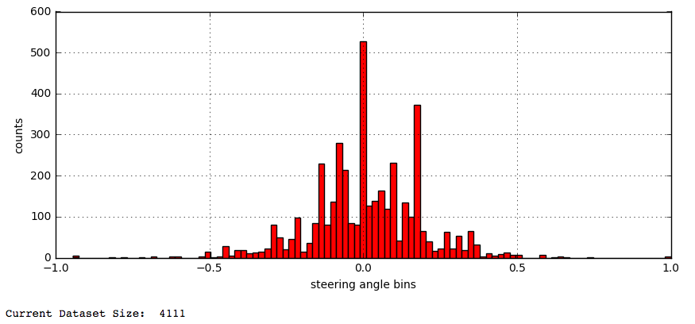  

### 2. Upsample

Time to augment so we can start upsampling under represented examples. We start by flipping 40% of the examples that are not zero steering angle. So far so good!

    
  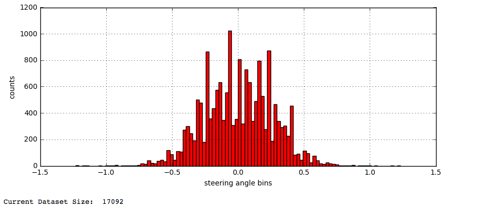  

### 3. Expose more varied examples

Variety is the spice of life; this is also true to training a well generalized model. For this problem we will introduce more steering angles by shifting the examples horizontally and adding or subtracting the appropriate angles corresponding to the shift we performed. There was no magic shift amount, you get this by experimenting. The result is below:

    
  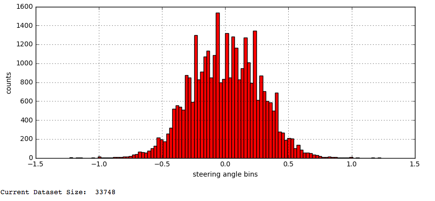  

Great our dataset/sample is looking better. Next, let's trim this to look more uniform. This was accomplished by:

1. Grabbing the bin ranges of the 100 bins.
2. Finding bins that have more than 400 examples.
3. Randomly sample and drop examples so we have no more than 400 examples.

    
  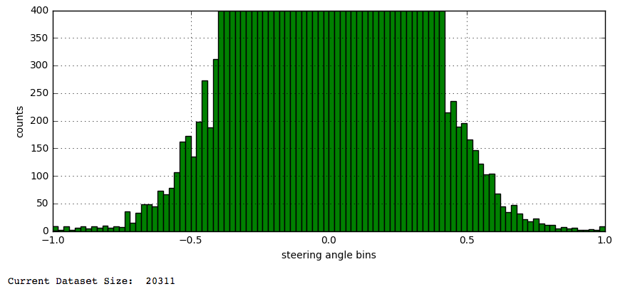  

How did I know 400 examples was enough? I simply kept reducing the number until I had reached a point where my model can still produced stable results. Below 400 my model started getting unstable results.

# Model Architecture and Training Strategy

### Main goals for us to think about while creating a model
1. Is it efficient for the task at hand?
2. If this was to be downloaded onto hardware in a car what would the power consumption and usability be like?
    * There is an interesting paper called [Deep Compression](https://arxiv.org/abs/1510.00149), which we don't implement here but it is food for thought and shows that model can be tiny and still work!

I started with a modified comma.ai model and I had a successful model, but it needed 300,000 trainable parameters. Reading the Deep compression paper and a blog post titled [Self-driving car in a simulator with a tiny neural network](https://medium.com/@xslittlegrass/self-driving-car-in-a-simulator-with-a-tiny-neural-network-13d33b871234#.x1kdv5hgt) I quickly realized that we can do better. The blog post linked shows a 63 parameter model that uses tiny images and a small network to get a stable model. I wanted to experiment and see if I could make it smaller and still stable. The solution developed over a number of experiments is a modified [SqueezeNet](https://arxiv.org/abs/1602.07360) implementation. With a squeeze net you get three additional hyperparameters that are used to generate the fire module:

1. S1x1: Number of 1x1 kernels to use in the squeeze layer within the fire module
2. E1x1: Number of 1x1 kernels to use in the expand layer within the fire module
3. E3x3: Number of 3x3 kernels to use in the expand layer within the fire module

#### Fire Module Zoomed In

  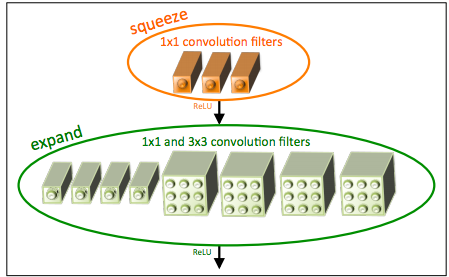  

The fire module is the workhorse of squeezenet. Sqeezenet as described in the paper is around 700k trainable parameters. I went through a process, where I kept reducing the number of parameters while all other variables were kept constant. You get the theme here? We are at the frontier and this calls for empirical testing. Through some experiments I went from 10k parameters to 1005, then 329, then 159, then **63** and finally **52**!!

## The final 52 parameter squeezenet variant Model!!

   
  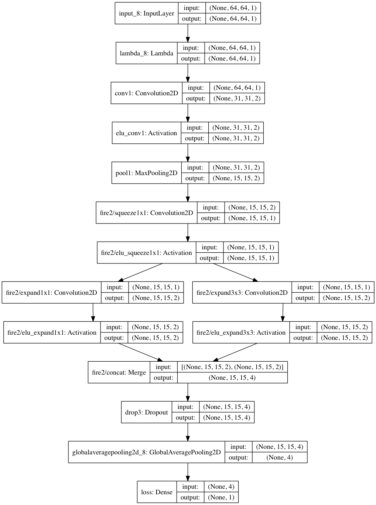  

This model combats overfitting by being super tiny and for kicks I added a small dropout layer. The model works on both tracks and has a six second epoch on my late 2012 Macbook air!! From the comma.ai model, it was evident that a validation loss of around 0.03 on 30% of **this** dataset results in a stable model that can handle the track at a throttle of around 0.2, which is a speed of around 20mph in the simulator. So, I didn't bother worrying about the epoch hyperparameter. I simply created a custom early termination Keras callback that stopped the training when we hit our requirement.

>One good rule of thumb I developed from this project is **to try and reduce the number of variables you are tuning to gain better results faster.**

# Training Strategy

To get the model to drive in the simulator, you need:

1. Show the model how to drive straight
2. How to recover if it drifts off track
3. How to handle turns

The Udacity slack community was a huge help here; from their experience, I used the left and right camera images and adjusted the steering (+.25 for left, -.25 for right) angles to show the model how to correct steering back to center. Then I used the horizontal shifting to capture more angles. This was enough to get a stable model working on the fastest setting (means lowest resolution) on both tracks.

Reducing input image size was the next challenge. We do this by first cropping the top and bottom from the image that would be noise to the model. Then we resize the image to (64,64) and convert to HSV and only returning the S channel. This takes us from (160,320,3) to (64, 64, 1)!!

### Before Cropping and Resizing.

   
  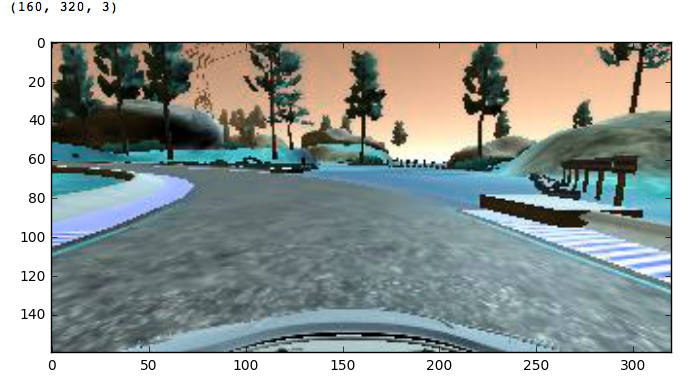  

### After Cropping and Resizing.

   
  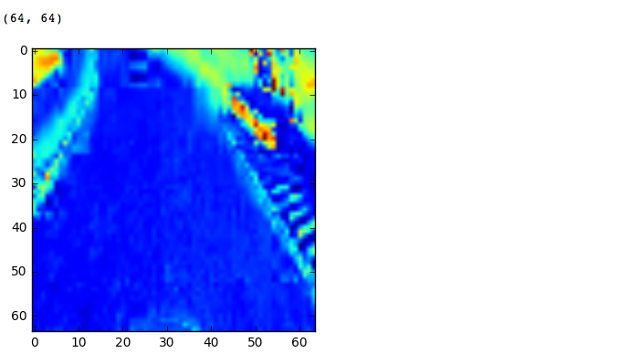  

# Hyperparameters

* Learning rate: 1e-1 (very aggressive!)
* Batch size: 128 (tried 64, 128, 256, 1024)
* Adam optimizer

I used Keras to do a validation split on 30% of the data and my custom early termination to stop the training when we we reach a validation loss of around 0.03!

   
  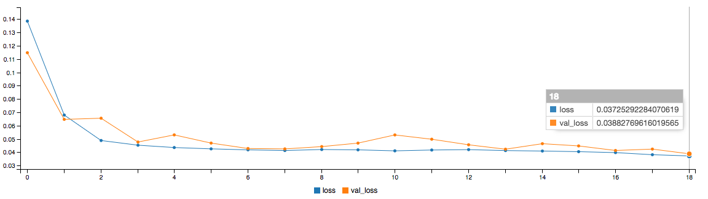  

**Note: this loss plot is from a previous run without early termination**

This model was tiny (52 params!) and with only ~20k images I was able to train it on a 2012 Macbook air. An epoch was about six seconds. The memory requirement were small so I removed my generator and just loaded the entire dataset!

   
  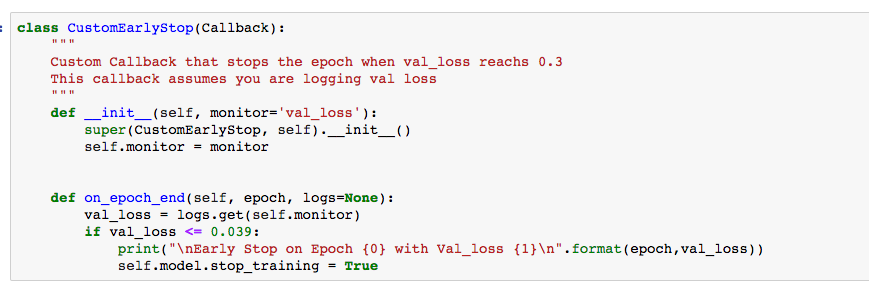  

  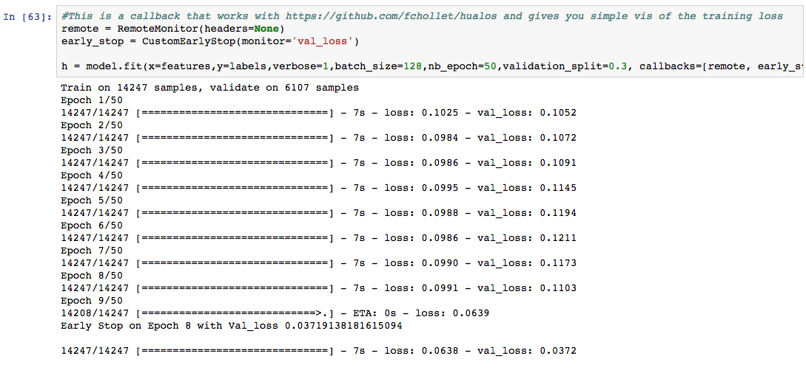  

# Pros
1. Can training on my Macbook air.
2. Enough to pass the challenge.
3. Smaller model meant I could experiment with more variables and different models to gain better intuition.
4. Learned that our current method of training with back prop is not efficient and that we can achieve a lot with a smaller network.
5. Get to use aggressive learning rate for faster convergence :D

# Cons
1. Can not handle highest resolution setting.
2. Can not go over .22 throttle and still be stable.
3. As the network increases in size, hard to understand why the decisions are being made. I can see this being a **huge** problem for legal reasons. The end-to-end neural network faction is not looking so good here!

> This bring me to the other rule of thumb, **every problem will have tradeoffs**. The question becomes what are the tradeoffs you are willing to make? This will depend on the business case you are solving!

# Files Submitted

This project includes the following files:

1. model.py containing the script to create and train the model
2. drive.py for driving the car in autonomous mode
3. model.h5 containing a trained convolution neural network
4. writeup_report.md summarizing the results
5. other helper files needed by model.py and drive.py

# References

1. [SqueezeNet](https://arxiv.org/abs/1602.07360)
2. [Deep Compression](https://arxiv.org/abs/1510.00149)
3. [Vivek Yadav's Learning human driving behavior using NVIDIA’s neural network model and image augmentation.](https://chatbotslife.com/learning-human-driving-behavior-using-nvidias-neural-network-model-and-image-augmentation-80399360efee#.zbkgfcnoz)
4. [xslittlegrass' Self-driving car in a simulator with a tiny neural network](https://medium.com/@xslittlegrass/self-driving-car-in-a-simulator-with-a-tiny-neural-network-13d33b871234#.x1kdv5hgt)
5. [Comma.ai steering model](https://github.com/commaai/research/blob/master/train_steering_model.py)
